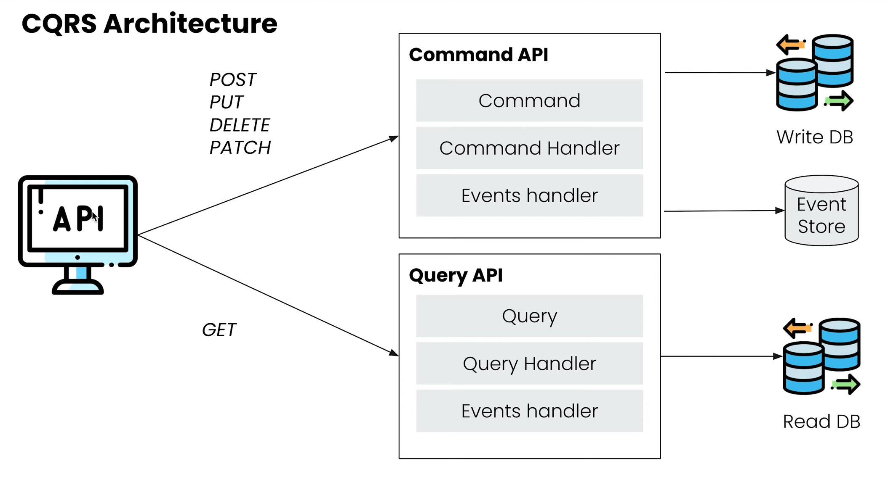
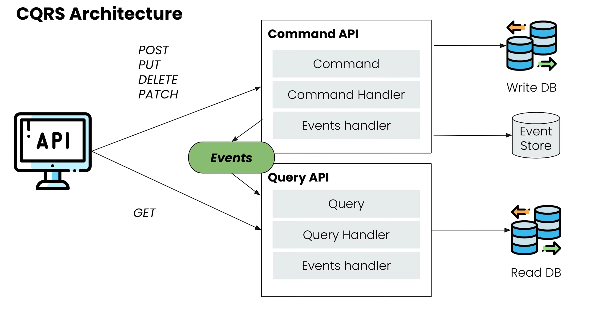
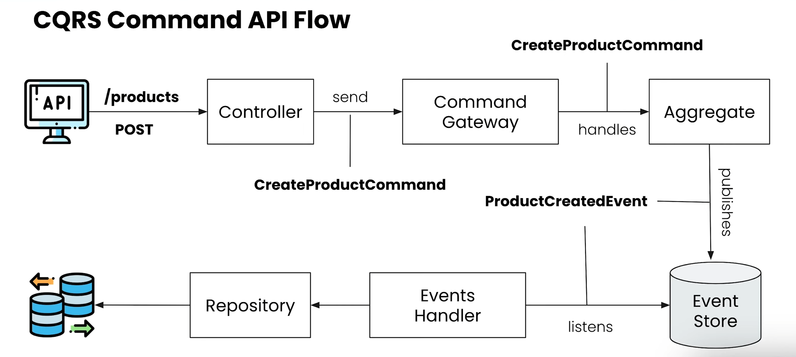
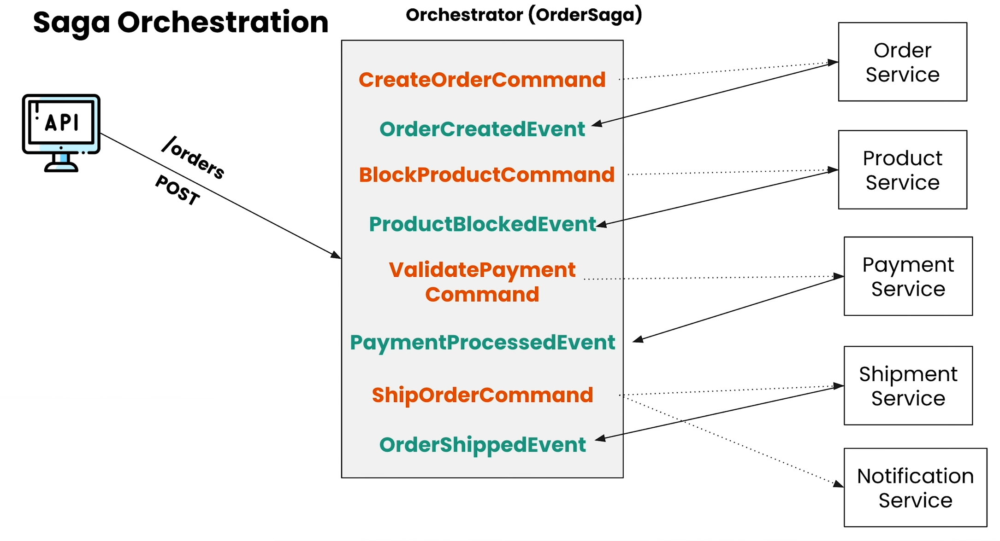
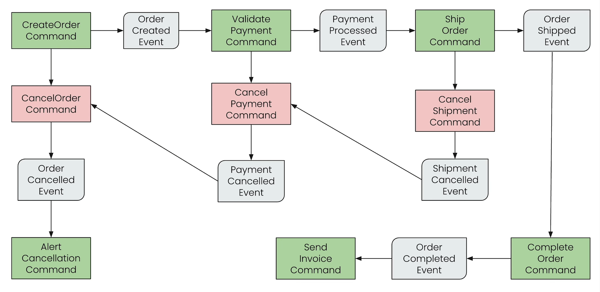

# CQRS and Event-Sourcing - SAGA Design Pattern using Springboot

## CQRS and Event-Sourcing

CQRS (Command Query Responsibility Segregation) is an architectural pattern that separates the responsibilities of reading data (queries) from modifying data (commands) into separate components.

Event-Sourcing is a pattern in which the state of a system is captured and stored as a sequence of events, rather than as a current snapshot. The events are used to recreate the current state of the system and to provide a complete history of all changes to the system.

CQRS and Event-Sourcing are often used together to create scalable, maintainable systems that can evolve over time while ensuring data consistency and integrity.

Commands in CQRS: POST, PUT, DELETE, PATCH (Write DB) and Event-Sourcing (Event Store)
Queries in CQRS: GET (Read DB)

> <https://developer.axoniq.io/event-sourcing/overview>

Axon Server Dockerfile:

```bash
docker run -d --name axonserver -p 8024:8024 -p 8124:8124 axoniq/axonserver
```

Axon Server url: <http://localhost:8024>

### Command API

- Command
- Command Handler
- Events Handler

### Query API

- Query
- Query Handler
- Events handler

### Maven dependencies for Axon server

```xml
<dependencies>
    <dependency>
        <groupId>org.axonframework</groupId>
        <artifactId>axon-spring-boot-starter</artifactId>
        <version>4.7.1</version>
    </dependency>
    <dependency>
        <groupId>com.google.guava</groupId>
        <artifactId>guava</artifactId>
        <version>31.1-jre</version>
    </dependency>
</dependencies>
```

### Products REST API

POST: <http://localhost:8081/products>

```json
{
    "name": "Playstation 5",
    "price": 600,
    "quantity": 1
}
```

GET: <http://localhost:8081/products>





## SAGA Design Pattern

SAGA (Single Activity, Multiple Aggregates) is a design pattern used in microservices architecture to ensure consistency and reliability of data transactions across multiple microservices. It is used to manage long-running transactions that involve multiple steps, where each step is performed by a different microservice. If a step fails, the SAGA pattern ensures that compensating transactions are executed to roll back the changes made in previous steps, preserving the consistency of data across the system. The SAGA pattern is often implemented using a message-based approach, where each step is triggered by a message sent between microservices.




Orders REST API

POST: <http://localhost:8082/orders>

```json
{
  "productId": "a5d3d654-a53a-11ed-b9df-0242ac120003",
  "quantity": 2,
  "addressId": "aef902f4-a53a-11ed-b9df-0242ac120003",
  "userId": "123"
}
```